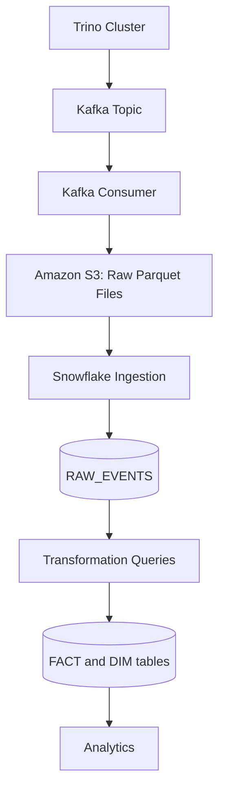

# Data Warehouse Architecture

The following diagram illustrates the data ingestion and transformation pipeline.

```mermaid
flowchart TD
    A["Trino Cluster"] --> B["Kafka Topic"]
    B --> C["Kafka Consumer"]
    C --> D["Amazon S3: Raw Parquet Files"]
    D --> E["Snowflake Ingestion"]
    E --> F[("RAW_EVENTS")]
    F --> G["Transformation Queries"]
    G --> H[("FACT and DIM tables")]
    H --> J["Analytics"]
```